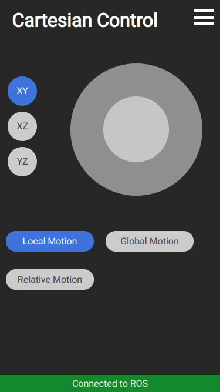
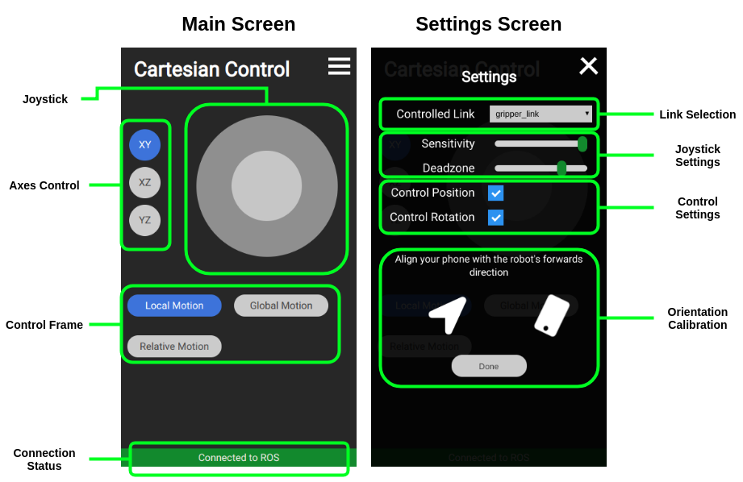

[](https://lgtm.com/projects/g/ARoefer/smart_eef_control/alerts/)
[](https://lgtm.com/projects/g/ARoefer/smart_eef_control/context:javascript)
[](https://lgtm.com/projects/g/ARoefer/smart_eef_control/context:python)

smart_eef_control
=================
Welcome to the easy way of manually controlling your robot's links! This repository contains a motion controller and a web interface for your phone, which will help you to control your robot more easily!

Introduction
---------------
A quick overview over this package.

### What does it do?
This package allows you to change your robot's links poses from your phone.

### What do I need?
You need a ROS-enabled robot which can be controlled using joint velocities, a phone and a computer on the robot's and the phone's network.

  Furthermore, you need the [giskardpy](https://github.com/ARoefer/giskardpy.git) motion control framework and the [rosbridge suite](http://wiki.ros.org/rosbridge_suite).

### Installation
Clone this package to a ROS-workspace and update the git submodules:
```
git clone https://github.com/ARoefer/smart_eef_control.git
cd smart_eef_control
git submodule init
git submodule update
```
If you don't have giskardpy or rosbridge already, install them too. For giskardpy make sure to checkout the **gebsyas** branch.

### Configuring for your robot
When the controller starts up, it loads its configuration data from the ROS parameter server. The configuration consists of the robot's URDF, assumed to be saved as *robot_description*, and the link configuration, assumed to be saved as *eef_control*.

The easiest way to set these parameters is through a YAML-file which is uploaded to the parameter server. An example:

```yaml
reference_frame: base_link
links:
- link: gripper_link
  velocity_limit: 0.6
  symmetry: xz
- link: head_camera_link
  velocity_limit: 0.2
```
The `reference_frame` parameter determines which robot link should be used as origin frame.
The `links` parameter contains a list of links which will be controllable by the controller.
Every link can specify a limit for its linear velocity. The `symmetry` parameter tells the controller, that the link is symmetrical along a plane. (Right now only *xz* is supported)
This information is used to remap the controller input so that the effect of the controls remains consistent, independent of the link's orientation. In the case of *xz* this means, that the pitch and yaw responses remain the same, even if the link is upside down.

The controller listens for joint states on the `joint_states` topic and publishes its commands to the `/commands` topic. You might need to remap these to suit your robot.

### Running the controller
The package provides a launch file, which runs the rosbridge- and http-servers. It can be started through ROS-launch using
```
roslaunch smart_eef_control servers.launch
```
The rosbridge server is hosted on port 9097, the HTTP server by default on 8000. While the bridge's port needs to be fixed, the HTTP port can be changed by passing the `web_port` argument to the launch file.

When you have uploaded your configuration to the parameter server, start the controller:
```
rosrun smart_eef_control eef_control.py [YOUR REMAPPINGS]
```
I'd recommend creating a launch file for your robot, which uploads you parameters to the parameter server, starts the servers and the controller with the appropriate remappings.

## The Web Interface
Once the servers are running, find out the IP-address of your hosting machine on the phone's network. This can be done using `ifconfig`, or through ubuntu's graphical network manager.

Type the address and port into your phone's webbrowser and add `/cart_controller.html` at the end. You should be confronted with the interface's main screen:



### Using the interface

The interface has two screens. The main screen which holds the controls and a settings screen which holds more long-term settings.

#### Main Screen
- The **joystick** moves the link in a plane. It is also the deadman-switch for the controller. As long as the joystick is being held, the controller sends commands.
- The **axes control** determines in which plane the joystick moves the link.
- The **control frame** buttons set which frame the control input is relative to.
  - *Local Motion* control is relative to the link's frame.
  - *Global Motion* control is relative to the controller's reference frame.
  - *Relative Motion* control is relative to the controller itself. Specifically to its rotation around the Z-axis. (More on that later)
- The **phone itself** is used for orientation control.
- The **connection status** displays the interface's connection to the ROS bridge server.

#### Settings Screen
- The **link selection** allows you to choose which link you want to control.
- The **joystick settings** can be used to set the sensitivity (strength) of the joystick control and the stick's dead zone.
- The **control settings** determine which command signals are being sent out by the controller.
- The **orientation calibration** is used to calibrate the robot's forward direction in the real world. The calibration is needed to use the *Relative Motion* mode.
